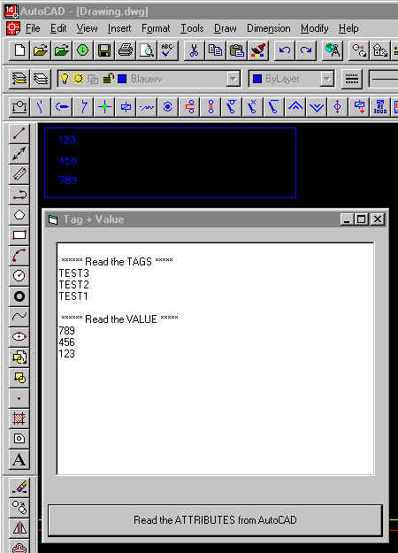



## Read attribute tags and values from AutoCAD 14\.01

### Description

You can read the Tags and their Values from any drawing into a textbox! If you want you can write them to Exel or Access etc...

Please vote!!!
 
### More Info
 
You need a full version of AutoCAD 14 or higher

If you don't have a full version off AutoCAD you can not use this code!

The code returns all de tags and the values from the attributes which you can find in the Drawing.dwg file

No side effects

             |
---                |---
**Submitted On**   |2002-11-28 08:37:02
**By**             |[Jan Devos](https://github.com/Planet-Source-Code/PSCIndex/blob/master/ByAuthor/jan-devos.md)
**Level**          |Advanced
**User Rating**    |3.3 (20 globes from 6 users)
**Compatibility**  |VB 6\.0
**Category**       |[Coding Standards](https://github.com/Planet-Source-Code/PSCIndex/blob/master/ByCategory/coding-standards__1-43.md)
**World**          |[Visual Basic](https://github.com/Planet-Source-Code/PSCIndex/blob/master/ByWorld/visual-basic.md)
**Archive File**   |[Read\_attri15046211282002\.zip](https://github.com/Planet-Source-Code/jan-devos-read-attribute-tags-and-values-from-autocad-14-01__1-41082/archive/master.zip)

